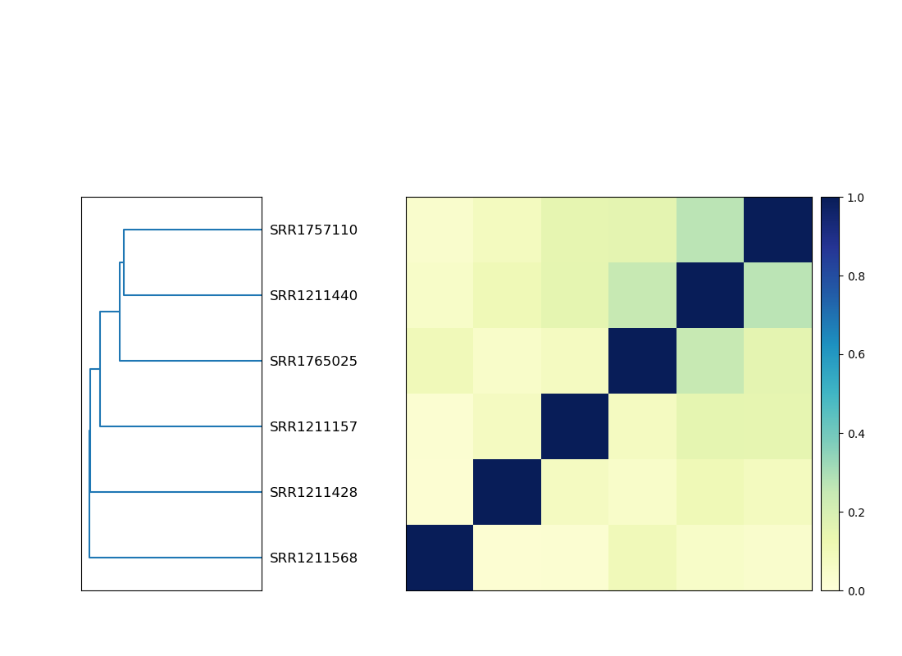
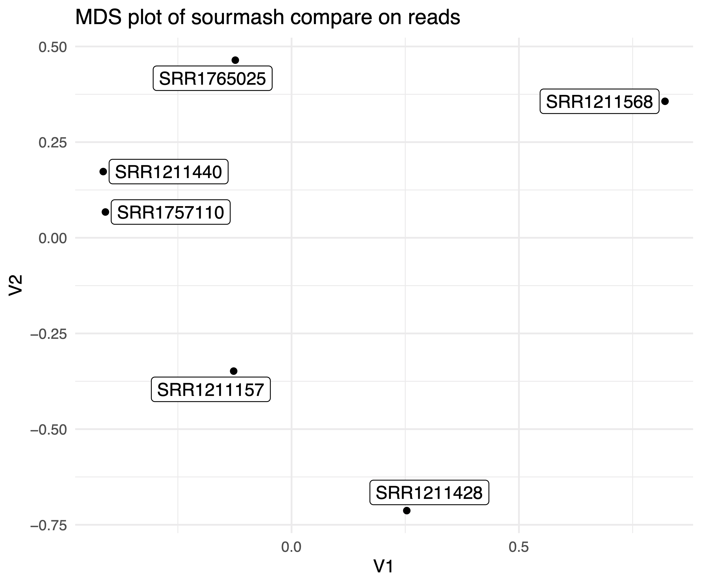

Comparing Samples with Sourmash
===

Many metagenomics projects are designed to assess the differences between microorganism composition between samples.
There are many ways to get at this question, but we can start by using k-mer profiles of the reads to quickly compare samples using `sourmash compare`.

## Workspace Setup

If you're starting a new work session on FARM, be sure to follow the instructions [here](05.starting-a-work-session.md).

First, let's make a directory that we will be working in:
```
cd ~/2020-NSURP
mkdir -p sourmash-compare
cd sourmash-compare
```

> Note: we made a directory called `sourmash` for the [taxonomic discovery](08.taxonomic-discovery-with-sourmash.md) module.
> It helps to name files and folders with details that will help you remember what results are contained therein.
> How could the prior module's folder name be changed to be more informative?


## Calculate sourmash signatures

Now we can calculate signatures for each of the files. This will take 5 or 10 minutes to run

```
for infile in ~/2020-NSURP/kmer-trim/*.kmertrim.fq.gz
do
    name=$(basename ${infile} .kmertrim.fq.gz)
    echo $name
    sourmash compute -k 21,31,51 --scaled 2000 --track-abundance --merge ${name} -o ${name}.kmertrim.sig ${infile}
done
```

> Note: Here we used bash `for loop` to compute signatures on each file with a single set of commands.
> Go through this [tutorial](https://datacarpentry.org/shell-genomics/04-redirection/index.html) to learn about loops!


## Compare sample signatures

Using these signatures, we can compare our samples.

```
sourmash compare -k 31 -o IBD.kmertrim.compare.np --csv IBD.kmertrim.compare.csv --ignore-abundance *sig
```

Now let's plot! Sourmash has a built in plot utility that we can take advantage of.
The output is a heatmap.


## Visualize the comparison using sourmash plot

```
sourmash plot --labels IBD.kmertrim.compare.np
```

This command produces three `png` files:
```
IBD.kmertrim.compare.np.hist.png
IBD.kmertrim.compare.np.dendro.png
IBD.kmertrim.compare.np.matrix.png
```

As usual, these files can be downloaded to your local computer with `scp`
```
scp -P 2022  -i /path/to/key/file username@farm.cse.ucdavis.edu:~/2020-NSURP/sourmash-compare/*.png ./
```
If you're on a mac using `zsh`, you may need to replace the `scp` with `noglob scp` in the command above.

If you're on windows, you may need to move the the files from the download location on your Linux shell over to the windows side of your computer before opening.

Once the files are on your local computer, double click to open each file. 
The `.matrix.png` is the heatmap file, which will show the pattern of similarity between samples

It should look like this:

.

What does this heatmap tell you about your samples?
For example, does it provide any information about which samples are from IBD patients, and which are from non-IBD patients?

## Visualize the comparison in an MDS plot

We can use this output to make a Multidimensional Scaling plot. MDS plots are
commonly used in visualize similarities and differences between samples.
Here the strength is we used the k-mer content of all of our reads to calculate similarity.

### Install the R packages ggplot2 and ggrepel

Since this is conda, it will recognize that it needs to install R alongside these, and take care of that for you!
Usually you'll want to be careful of _which_ version of R you're installing, but since we're just doing this one R command, we'll be a little lax about it.

```
conda install r-ggplot2 r-ggrepel 
```

### Download an R script to make the MDS plot

The script source is [here](https://raw.githubusercontent.com/dib-lab/2020-NSURP/master/scripts/mds_plot.R) if you are interested!
```
wget https://raw.githubusercontent.com/dib-lab/2020-NSURP/master/scripts/mds_plot.R
```

### Run the R script
```
Rscript mds_plot.R IBD.kmertrim.compare.csv IBD.kmertrim.compare.mds.pdf
```

This outputs a file `IBD.kmertrim.compare.mds.pdf`.
You can see that file by downloading to your computer.
It should look something like this:

.

How do the samples cluster? How does this compare to our heatmap, generated by `sourmash plot`, above?

